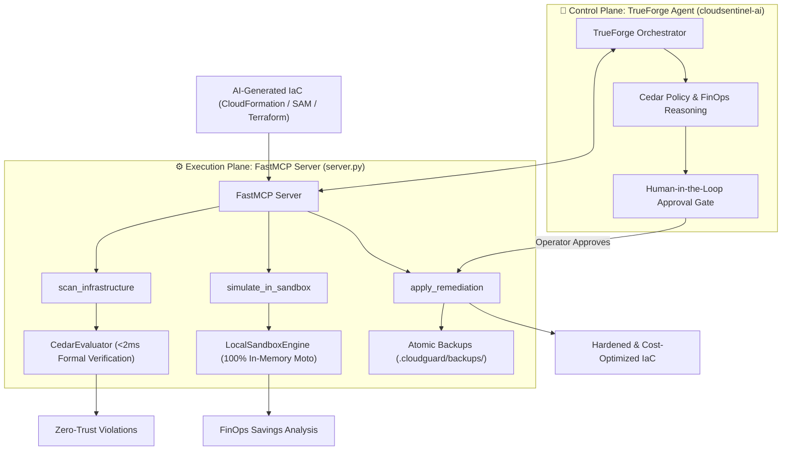

# 🛡️ CloudSentinel
### Autonomous Zero-Trust DevSecOps Gatekeeper & FinOps Optimizer

> **TrueForge Hackathon Submission**  
> *Built with TrueFoundry's TrueForge agent orchestration layer paired with an in-memory Moto DevSecOps simulation engine.*

---

## 📌 Executive Summary

Modern AI code assistants (Cursor, Copilot, ChatGPT) write Infrastructure-as-Code (IaC) at breakneck speeds, but frequently generate toxic security defaults: **wildcard IAM policies**, **unencrypted S3 buckets**, **open `0.0.0.0/0` security groups**, and **grossly oversized EC2 instances** that silently bleed cloud budgets.

**CloudSentinel** is an autonomous, local-first DevSecOps and FinOps gatekeeper that intercepts AI-generated IaC *before* deployment. By combining **formal logic Cedar policies**, an **in-memory Moto simulation sandbox**, and **TrueForge agent orchestration**, CloudSentinel eliminates both security risks and cloud cost waste in sub-2ms verification cycles with zero cloud billing exposure.

---

## 🏗️ Architecture

CloudSentinel operates on a dual-tier control and execution plane:



### 1. Control Plane (Brain): TrueForge Agent (`cloudsentinel-ai`)
- **Policy Reasoning**: Evaluates policy violations and assesses architectural risk levels (`READ_ONLY`, `SIMULATED`, `DESTRUCTIVE`).
- **FinOps Cost Modeling**: Analyzes compute instances and orphaned volumes to recommend rightsized SKUs and cost reductions.
- **Human-in-the-Loop (HITL) Gate**: Enforces mandatory operator sign-off before modifying disk files or deploying patches.

### 2. Execution Engine (Core): FastMCP Server (`server.py`)
- **AST Parsing**: Ingests CloudFormation, AWS SAM, and Terraform JSON into normalized Cedar entities.
- **In-Memory Sandboxing**: Uses Moto to spin up mock S3, IAM, and EC2 resources in isolated memory space without making live AWS API calls.
- **Atomic Rollback & Backups**: Automatically snapshots files to `.cloudguard/backups/` and generates unified diffs before applying any remediation.

---

## ⚡ Key Features

| Capability | Description | Impact |
| :--- | :--- | :--- |
| **Deterministic Zero-Trust Enforcement** | Formal AWS Cedar policy engine (`zerotrust.cedar`) evaluating AST entities in **< 2ms** with fail-closed semantics. | Blocks wildcard IAM actions (`Action: *`), open `0.0.0.0/0` ingress, and unencrypted buckets. |
| **FinOps Compute Rightsizing** | Automatically detects oversized EC2 instances and orphaned EBS volumes. | **87.5% compute cost reduction** (e.g., rightsizing `m5.4xlarge` to `m5.large` saves **~$5,886/year** per instance). |
| **Zero-Cost Mock Sandboxing** | 100% in-memory AWS emulation using Moto. | Validates bucket encryption, IAM trust policies, and SG ingress without AWS cloud costs or external egress. |
| **Non-Destructive Patching** | Computes unified diffs and archives timestamped `.bak` files in `.cloudguard/backups/`. | Safe automated remediation with single-command rollback capability. |
| **FastMCP Tooling Protocol** | Standardized Model Context Protocol (MCP) server ready for Cursor, Claude Desktop, and TrueForge agents. | Plug-and-play integration into any MCP-compatible agent environment. |

---

## 📦 Project Structure

```text
├── server.py                        # FastMCP Server exposing scan, simulate, and remediation tools
├── run_demo.py                      # Standalone visual test runner demonstrating scan workflow
├── pytest.ini                       # Pytest configuration
├── .gitignore                       # Clean production ignore rules
├── dashboard/
│   ├── index.html                   # High-density zero-trust web console
│   └── serve.py                     # Local dashboard preview server
├── cloudsentinel/
│   ├── __init__.py                  # Package exports
│   ├── models.py                    # Pydantic v2 schemas & Enums (Severity, ActionRisk, ScanResult)
│   ├── engine/
│   │   ├── __init__.py              # Engine exports
│   │   ├── evaluator.py             # AST IaCParser & CedarEvaluator with PyYAML intrinsics
│   │   └── sandbox.py               # LocalSandboxEngine running 100% in-memory via Moto
│   └── policies/
│       └── zerotrust.cedar          # Formally verified AWS Cedar zero-trust security policies
├── examples/
│   ├── vulnerable.json              # Sample stack showcasing unencrypted S3 & open PostgreSQL SG
│   ├── insecure_template.yaml       # Sample stack with IAM wildcard, unencrypted S3, open SG, orphaned EBS
│   └── compliant_template.yaml      # Hardened, zero-trust compliant equivalent stack
└── tests/
    └── test_mcp_server.py           # Automated test suite verifying all 3 FastMCP tools
```

---

## 🚀 Quick Start & Installation

### Prerequisites
- Python `>= 3.11`
- Active virtual environment with dependencies installed:

```bash
# Clone the repository
git clone https://github.com/rakshitgarg99/TrueForge-CloudSentinel.git
cd TrueForge-CloudSentinel

# Create and activate virtual environment
python3 -m venv .venv
source .venv/bin/activate

# Install dependencies
pip install cedarpy moto boto3 fastmcp pydantic pyyaml pytest
```

---

## 🖥️ Running the FastMCP Inspector

CloudSentinel exposes three tools through the standard Model Context Protocol. You can launch the interactive FastMCP Dev Inspector in your browser:

```bash
fastmcp dev inspector server.py
```

This launches the FastMCP Inspector UI (typically at `http://localhost:5173` or similar), providing interactive testing for:
1. `scan_infrastructure(file_path)`
2. `simulate_in_sandbox(candidate_content, iac_format)`
3. `apply_remediation(file_path, verified_content)`

---

## 📊 Launching the Web Dashboard

CloudSentinel provides a high-density, professional engineering console for real-time IaC inspection, live Cedar policy auditing, unified diff rendering, and Moto sandbox telemetry:

```bash
# Launch via built-in dashboard preview runner
python dashboard/serve.py 3000

# Or via Python's standard HTTP server
python -m http.server 3000 --directory dashboard
```

Open **`http://localhost:3000`** in any browser. It features:
- Interactive file switcher (`vulnerable.json`, `insecure_template.yaml`, `compliant_template.yaml`)
- 1-click **Zero-Trust Cedar Audit** with sub-2ms latency metrics
- 1-click **Moto Sandbox Simulation** with simulated resource logs
- 1-click **Non-Destructive Patch** with git-style unified diff & atomic `.cloudguard/backups/` tracking

---

## 🔍 The Zero-Trust Verification Workflow

### 1. Initial State: Scanning Vulnerable IaC
When an AI assistant creates an unhardened template like `examples/vulnerable.json`:

```json
{
  "AWSTemplateFormatVersion": "2010-09-09",
  "Resources": {
    "FinancialDataBucket": {
      "Type": "AWS::S3::Bucket",
      "Properties": { "BucketName": "company-financial-records" }
    },
    "DatabaseSecurityGroup": {
      "Type": "AWS::EC2::SecurityGroup",
      "Properties": {
        "GroupDescription": "Database access",
        "SecurityGroupIngress": [
          { "IpProtocol": "tcp", "FromPort": 5432, "ToPort": 5432, "CidrIp": "0.0.0.0/0" }
        ]
      }
    }
  }
}
```

Running `scan_infrastructure("examples/vulnerable.json")` yields:

```json
{
  "compliant": false,
  "violations_count": 2,
  "execution_time_ms": 17.73,
  "violations": [
    {
      "rule_id": "s3-no-unencrypted-or-public-buckets",
      "resource_id": "FinancialDataBucket",
      "severity": "HIGH",
      "reason": "S3 bucket lacks server-side encryption or has public access enabled",
      "recommendation": "Enable default server-side encryption (AES256 or aws:kms) and configure PublicAccessBlockConfiguration to block all public access"
    },
    {
      "rule_id": "security-group-no-open-ingress",
      "resource_id": "DatabaseSecurityGroup",
      "severity": "HIGH",
      "reason": "Security group allows open ingress traffic from 0.0.0.0/0",
      "recommendation": "Restrict ingress CIDR blocks to specific authorized IP ranges or VPC private subnets"
    }
  ]
}
```

### 2. Sandbox Simulation (`simulate_in_sandbox`)
The TrueForge Agent generates a patched candidate and validates it safely in Moto:
- Verifies AES-256 server-side encryption and `PublicAccessBlockConfiguration` on the S3 bucket.
- Verifies that PostgreSQL port 5432 is restricted to the application tier (`SourceSecurityGroupId`).
- Confirms zero deployment runtime errors.

### 3. Safety-Gated Remediation (`apply_remediation`)
With operator approval, CloudSentinel:
1. Archives a timestamped backup in `.cloudguard/backups/`.
2. Emits a clean unified diff.
3. Atomically overwrites the file with the verified configuration.

### 4. Post-Remediation Re-Scan
Running `scan_infrastructure("examples/vulnerable.json")` on the patched file:

```json
{
  "compliant": true,
  "violations_count": 0,
  "execution_time_ms": 1.4,
  "violations": []
}
```
**Zero violations. Compliant in 1.4 ms.**

---

## 🧪 Automated Test Suite

Run the full pytest suite to verify all MCP tools, AST parsers, Cedar evaluators, and sandbox simulations:

```bash
pytest tests/test_mcp_server.py -v
```

Expected output:
```text
tests/test_mcp_server.py::test_scan_infrastructure_insecure PASSED       [ 14%]
tests/test_mcp_server.py::test_scan_infrastructure_compliant PASSED      [ 28%]
tests/test_mcp_server.py::test_scan_infrastructure_file_not_found PASSED [ 42%]
tests/test_mcp_server.py::test_simulate_in_sandbox_insecure PASSED       [ 57%]
tests/test_mcp_server.py::test_simulate_in_sandbox_compliant PASSED      [ 71%]
tests/test_mcp_server.py::test_apply_remediation_lifecycle PASSED        [ 85%]
tests/test_mcp_server.py::test_apply_remediation_new_file PASSED         [100%]

============================== 7 passed in 0.87s ===============================
```

### Run the Standalone Demo Script

```bash
python run_demo.py
```

---

## 🏆 Hackathon Value Proposition

1. **Deterministic Guardrails over Probabilistic Guesswork**: LLMs write code probabilistically; Cedar formal logic validates code deterministically.
2. **True Zero-Billing DevSecOps**: In-memory Moto isolation means developers and security teams can run unlimited simulation loops without a dollar spent on AWS bills.
3. **Dual DevSecOps + FinOps Impact**: Stops security breaches while optimizing infrastructure sizing to deliver instant ROI.
